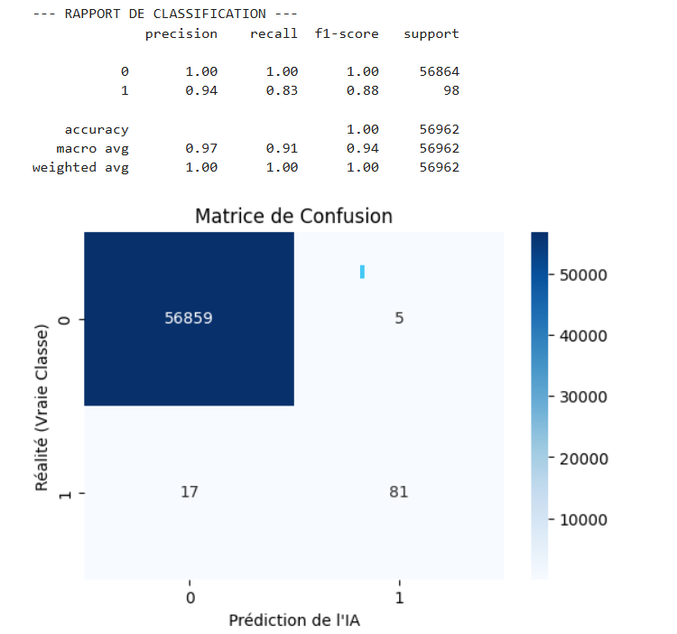
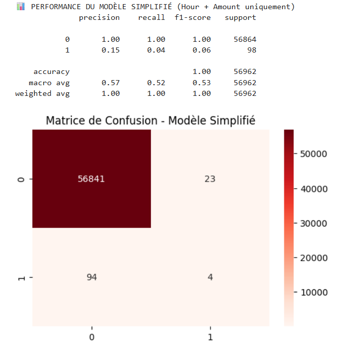

## Documentation Technique 📘 : Détection de Fraude Bancaire

**Auteur** : Ascelle Laurence DJIWA 
**Réalisé au niveau** : M1 MIAGE

# Contexte et Problématique
Dans le secteur bancaire, la fraude à la carte de crédit coûte des milliards chaque année.  
Le défi est double : 
    **Le déséquilibre** : Les transactions frauduleuses représentent moins de 0,2% des données.  
    **Le temps réel** : Il faut décider en quelques millisecondes si on bloque ou non une carte. 

**Problème soulevé** :  
Comment construire un système capable de filtrer automatiquement les transactions suspectes sans bloquer les clients honnêtes ? 

# La Solution Proposée
Une architecture en trois couches : 
    **Le Cerveau (IA)** : Un modèle Random Forest capable de classer les transactions. 
    **L'Usine (Pipeline ETL)** : Un script automatisé qui transforme les données brutes en données "compréhensibles" pour l'IA. 
    **L'Interface** : Un outil de décision métier pour les agents de la banque. 

# Étapes de Réalisation Détaillées
**Étape 1 : Analyse et Préparation (EDA)** 
    Outils : Jupyter Notebook, Pandas, Matplotlib, Seaborn. 
    Action : Chargement du dataset Kaggle (**284 807** transactions). 
    Détail technique : Nous avons remarqué que les transactions frauduleuses ne suivent pas le rythme de vie normal (**pic de fraude à 2h du matin**). 
    Problème rencontré : Les **montants** des transactions étaient **trop disparates** (de 0€ à 25 000€). 
    Solution : Utilisation du **RobustScaler** pour normaliser les montants sans être biaisé par les valeurs extrêmes. 

**Étape 2 : Le "Double" Entraînement** 
Nous avons créé deux modèles différents avec scikit-learn : 
    **Modèle Expert** : Utilise 30 variables (**V1** à **V28** + Heure + Montant) : c'est le plus puissant. 
    **Modèle Simple** : Utilise uniquement 2 variables (Heure + Montant). Il sert à la simulation manuelle quand on n'a pas accès aux données anonymisées complexes. 

**Étape 3 : Industrialisation (Le Pipeline)** 
Outils : Python, OS, Joblib. 
Logique : Pour passer de la "recherche" à la "production", on a créé pipeline.py. 
Ce qu'il fait précisément : Il prend le fichier creditcard.csv, calcule l'heure ((Time // 3600) % 24), applique le scaling, et réorganise les colonnes exactement dans l'ordre attendu par l'IA. 

**Étape 4 : Interface Utilisateur (Web App)** 
Outil : Streamlit. 
Structure : Architecture multi-pages : 
    **Page Audit** : Reçoit le fichier nettoyé et applique le "Modèle Expert". Elle affiche un verdict clair : BLOQUER ou APPROUVER. 
    **Page Simulation** : Permet de tester des hypothèses à la main. 

# Problèmes Rencontrés & Solutions 
**Erreur de Chemin** (File Not Found) : Python ne trouvait pas le CSV car il cherchait dans le dossier utilisateur et non le dossier projet. 
    Solution : Utilisation de `os.path.abspath(__file__)` pour rendre le script autonome. 
**Modèle "Aveugle" en simulation manuelle** : L'IA répondait toujours "Normal" même pour 100 000€. Le travail a d'abord été fait en donnant automatiquement la valeur **0** aux variables V1 à V28. 
    Solution : Création d'un second modèle spécifique (Modèle Simple) car donner des "zéros" aux variables V1-V28 perdait l'IA. (Solution à améliorer). 
**Ordre des colonnes** : L'IA se trompait si les colonnes n'étaient pas exactement dans le même ordre qu'à l'entraînement. 
    Solution : Forçage de la liste des colonnes dans pipeline.py. 

# Analyse des Résultats
L'évaluation des modèles ne s'est pas limitée à l'**exactitude (Accuracy)**, qui est trompeuse sur des données déséquilibrées. Nous avons privilégié le **Rappel (Recall)** pour mesurer la capacité à détecter les fraudes, et la **Précision** pour limiter l'impact sur les clients honnêtes. 

  

📊 **A. Modèle Expert (30 variables)** 
Le modèle expert montre une performance robuste, confirmant que les variables anonymisées (**V1** à **V28**) contiennent des signatures de fraude essentielles. 
**Rappel (0.83)** : Le modèle parvient à intercepter 81 fraudes sur les 98 présentes dans l'échantillon de test. 
**Précision (0.94)** : Lorsqu'une transaction est classée comme frauduleuse, le modèle a raison dans 94% des cas. 
**Matrice de Confusion** : 
    **56 859 Vrais Négatifs** : Transactions normales correctement approuvées. 
    **5 Faux Positifs** : Seulement 5 clients honnêtes ont été bloqués à tort. 
    **17 Faux Négatifs** : 17 fraudes ont réussi à passer à travers le filtre. 
    **81 Vrais positifs** : 81 fraudes sur 98 présentes ont été détectées. 

 
  
📊 **B. Modèle Simplifié (02 variables : Heure, Montant)** 
Ce modèle met en lumière les limites d'une analyse basée uniquement sur des données de surface. Les résultats montrent un effondrement de la capacité de détection. 
**Rappel (0.04)** : Le modèle ne détecte que 4 fraudes sur 98. C'est un échec opérationnel car 96% des fraudes sont acceptées. 
**Précision (0.15)** : Le modèle génère beaucoup de **bruit** ; sur les transactions qu'il signale, seulement 15% sont réellement des fraudes. 
**Matrice de Confusion** :On observe **94 Faux Négatifs** : le modèle est "aveugle" à la fraude car il n'a pas assez d'indices pour différencier une grosse dépense nocturne honnête d'une fraude. 

 **Conclusion de l'Analyse** : 
La comparaison des deux modèles démontre que la fraude à la carte bancaire ne peut être prédite efficacement par le seul montant ou l'heure de la transaction. L'utilisation des composants principaux (**V1** à **V28**) est indispensable pour capturer des comportements atypiques.

# Limites Actuelles et Améliorations Futures
Le projet actuel est un MVP. Pour une mise en production réelle, plusieurs points critiques doivent être adressés : 
**1. Limites du Modèle Simplifié** 
Faiblesse prédictive : Comme observé lors des tests, l'Heure et le Montant seuls sont insuffisants pour caractériser une fraude. Le modèle simplifié présente un taux de faux négatifs trop élevé. 
Leçons apprises : La fraude bancaire est multidimensionnelle. L'absence des variables "comportementales" (V1 à V28) rend le modèle aveugle aux schémas complexes. 
Amélioration : Pour la simulation manuelle, il faudrait intégrer d'autres variables accessibles (ex: pays d'origine, type de terminal, nombre d'essais de code PIN) plutôt que de simples données temporelles. 
**2. Déséquilibre des classes (Data Imbalance)** 
Problème : Avec seulement **0,17% de fraudes**, le modèle tend à prédire "Normal" par défaut pour maximiser son score de précision globale. 
Amélioration technique : Implémenter des techniques de rééchantillonnage comme **SMOTE (Synthetic Minority Over-sampling Technique)** pour équilibrer les classes lors de l'entraînement, ou ajuster les poids des classes dans le Random Forest. 
**3. Dérive du modèle (Model Drift)** 
Problème : Les fraudeurs changent constamment de tactique. Un modèle entraîné aujourd'hui sera obsolète dans 6 mois. 
Solution Entreprise : Mettre en place un Monitoring continu pour détecter la baisse de performance et déclencher un réentraînement automatique. 

# Organisation du Dépôt (Architecture logicielle)
Afin de respecter les standards du Software Engineering, le projet est structuré de manière modulaire : 
 **data/** 
    **brut/** : Contient le jeu de données original non modifié. C'est notre "Source of Truth". 
    **propre/** : Reçoit la sortie du pipeline ETL. Ce dossier contient les données prêtes à être injectées dans l'application après nettoyage et normalisation. 

 **models/** 
    Stocke les fichiers binaires `.pkl` issus de l'entraînement. Séparer les modèles du code permet de mettre à jour l'intelligence de l'application sans toucher à l'interface. 

 **notebooks/** 
    `eda.ipynb` : Contient tout le cheminement intellectuel. De l'analyse exploratoire des données (EDA) à la validation statistique des modèles. 

 **pages/** (Standard Streamlit) 
    Contient les différents modules de l'application Web. Streamlit utilise ce dossier pour générer automatiquement le menu de navigation latéral. 
    

 **scripts/** 
    `pipeline.py` : C'est le moteur d'automatisation. Il contient les fonctions de transformation qui assurent que les données en entrée correspondent au format attendu par les modèles. 
    

 **Fichiers racines** 
    `app.py` : Le fichier principal qui lance l'application. Il sert de page d'accueil et de configuration globale. 
    `requirements.txt` : Liste les bibliothèques externes nécessaires. Crucial pour la portabilité du projet (permet un déploiement rapide via `pip install -r`). 
    `README.md` & `Documentation_technique.md` : Assurent la transmission du savoir et la reproductibilité du projet. 

# Guide d'installation
Suivez ces étapes dans l'ordre pour configurer et lancer le projet sur votre machine. 

1.Installez les bibliothèques avec `pip install -r requirements.txt` ou `pip install pandas scikit-learn streamlit joblib matplotlib seaborn`. 
2.Téléchargez le dataset `creditcard.csv` sur Kaggle (Vous pouvez utiliser le mien dans `archive.zip` mais vous risquez avoir les mêmes résultats que ceux obtenus dans ce projet) puis placez le fichier dans le dossier `data/brut/`. 
3.Lancez le Notebook `notebooks/eda.ipynb` pour générer les fichiers `.pkl` dans `models/`. 
4.Exécutez la commande `python scripts/pipeline.py` pour créer le fichier nettoyé dans `data/propre/`. 
5.Lancez l'application avec la commande `streamlit run app.py`. 

